# Electro Trade Hub - CSE 471 Project

## Sign In Page

This is the sign in page where users can sign in and proceed for next steps.

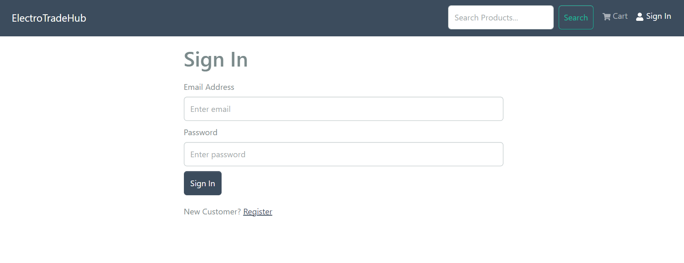

## User Registration Page

This is the page where user can create an account for our website.

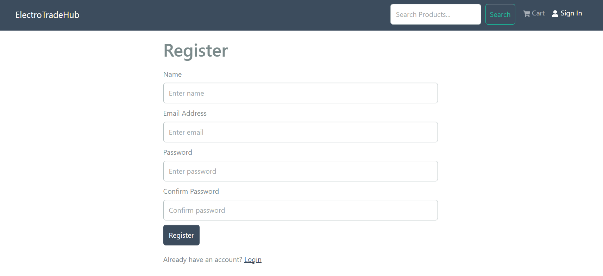

## Home Page

This is the first page the user will see after logging in or creating an account. This page contains a carousel, with all the products below.

## Product Details Page and Review

If we click a product then we can see the product details page with a form for submiting reviews and looking at all the reviews for that product.

## Order Pages

First the cart Page

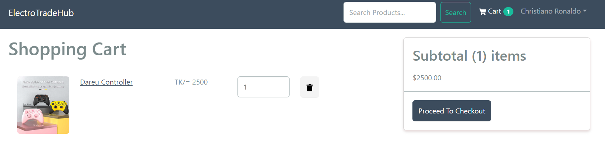

Then our shipping page

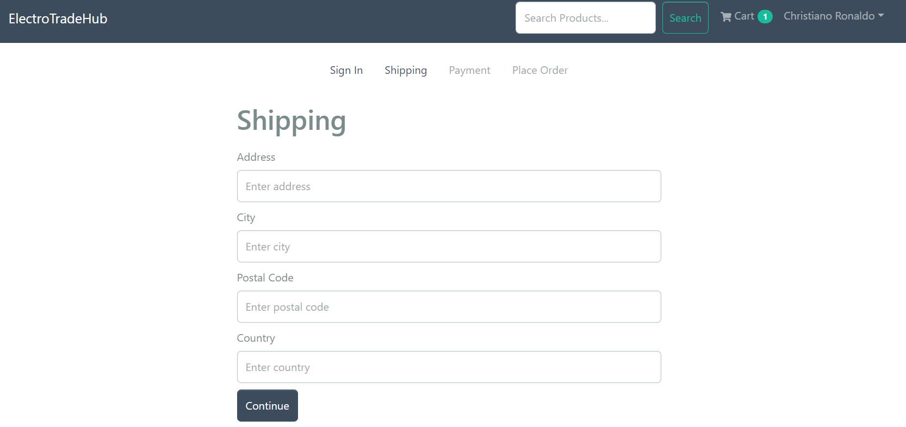

Then we have our payment selection page

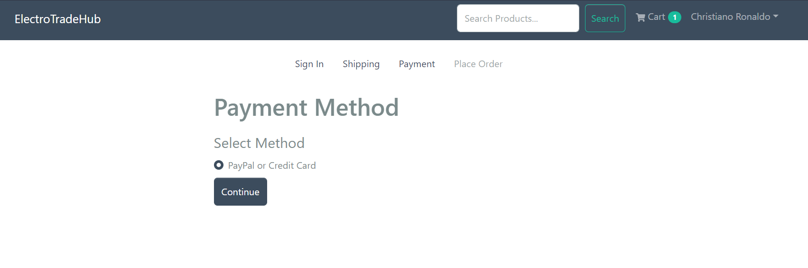

Then we have to confirm the order

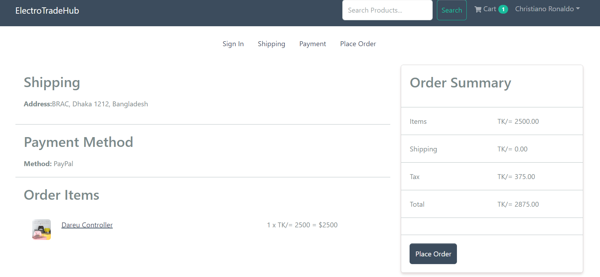

Now the payment page

1. Before Payment Completed
   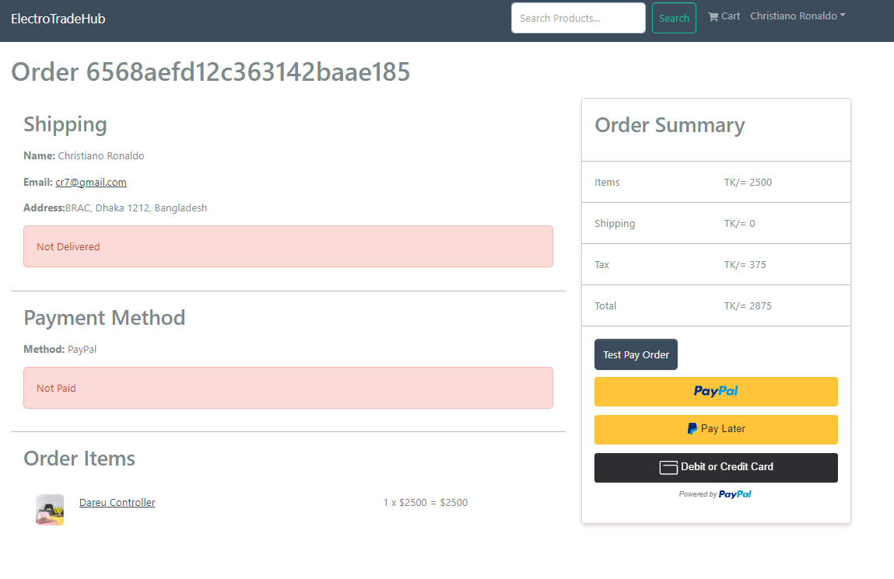
2. After Payment
   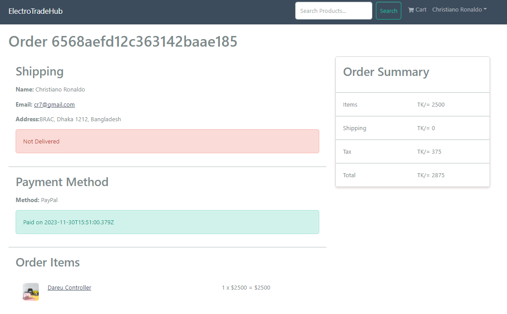

## Admin Pages

Here are the admin pages

This is how the admin navbar looks like

These are the options admin can perform
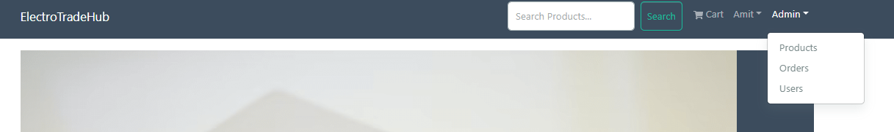

This is the page where admin can add product edit and delte
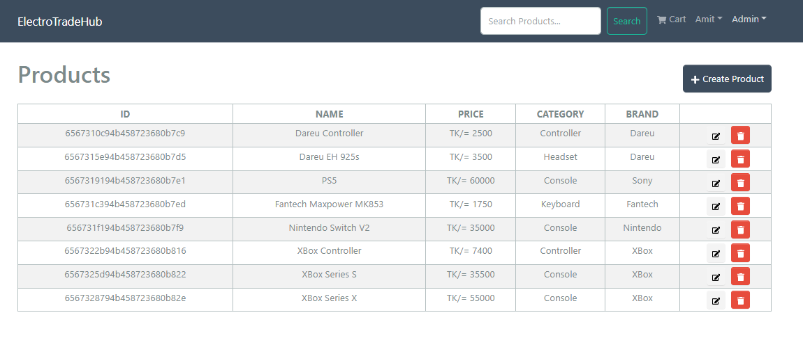

This is order page that admin will see only
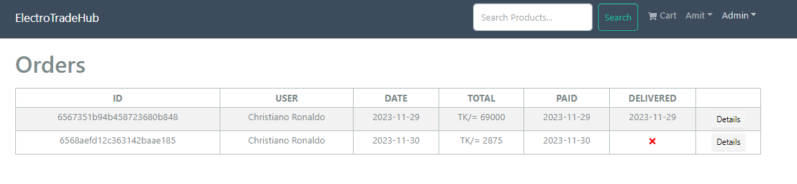

This is how the page looks like before and after order delivered

1. Before Marked Delivered
   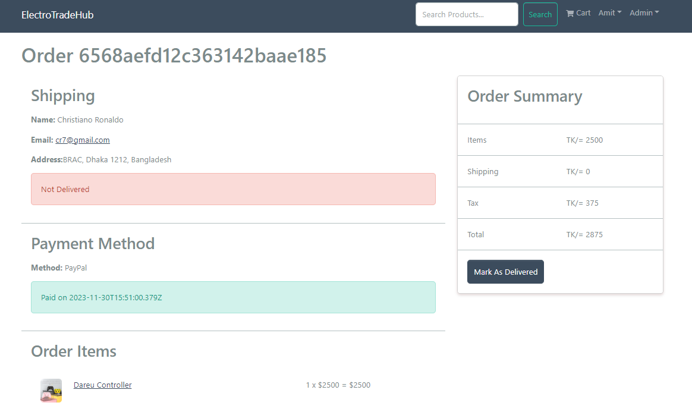
2. After marked delivered
   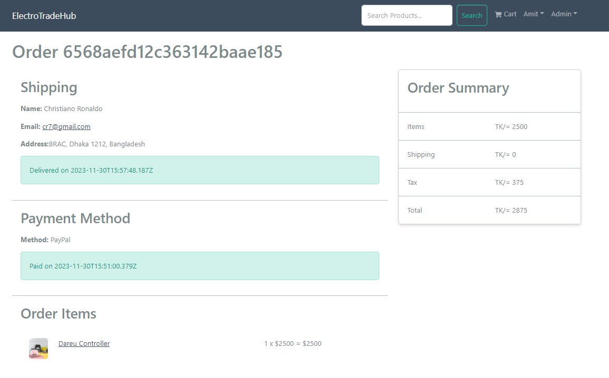
